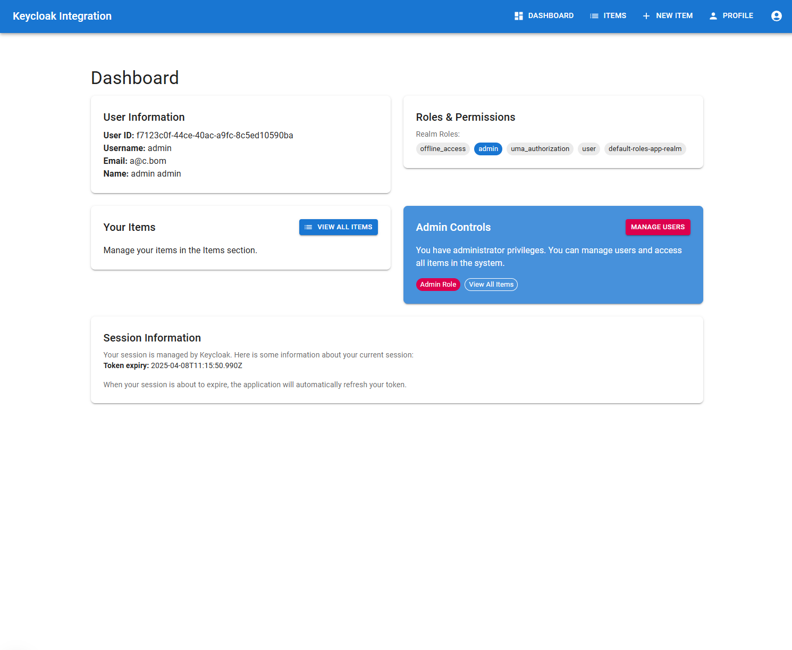
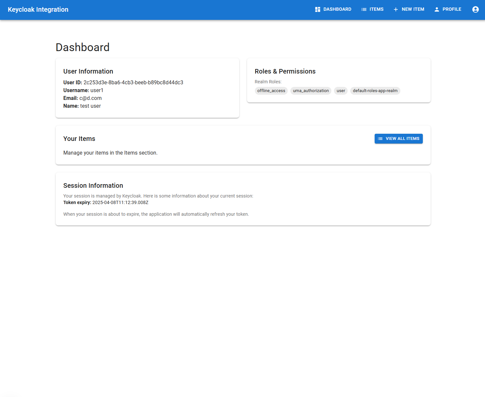
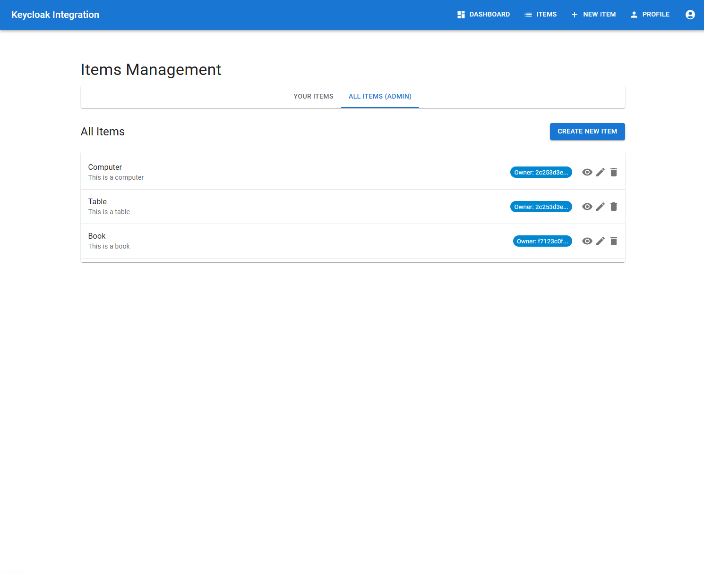
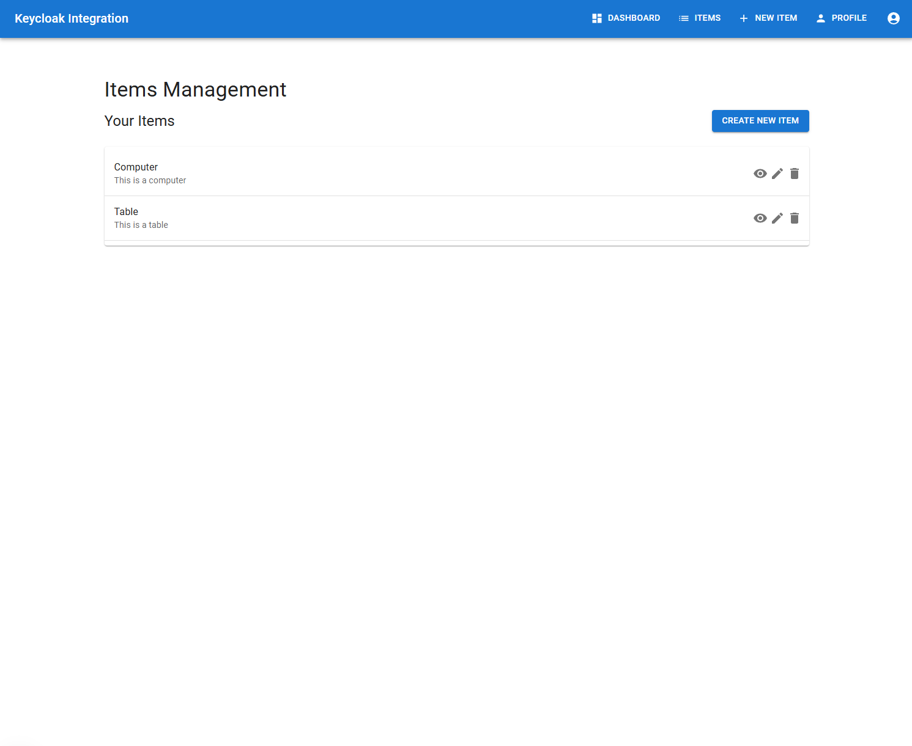

# Enterprise Identity Management Portal

A full-stack application demonstrating deep integration between Keycloak, Next.js, and FastAPI. This project showcases
enterprise-grade authentication and authorization patterns with Keycloak as the centralized identity provider.


## Features

- **Centralized Authentication**: Complete Keycloak integration with Next.js and FastAPI
- **Role-Based Access Control**: Fine-grained permission management
- **User Profile Synchronization**: Automatically sync user data between Keycloak and app database
- **Protected Resources**: Secure API endpoints and frontend routes
- **Admin Dashboard**: User management and access to all items
- **Token Management**: Handle refresh tokens, token introspection, and session management

Examples:

|             | Admin View                                     | User View                                    |
|-------------|------------------------------------------------|----------------------------------------------|
| Dashboard   |  |  |
| Items Panel |          |          |

## Technology Stack

- **Frontend**: Next.js 15 (App Router), TypeScript, Material UI, next-auth
- **Backend**: FastAPI, SQLAlchemy, PostgreSQL, Python-jose (JWT handling)
- **Identity & Infrastructure**: Keycloak 25.0.1, Docker / Docker Compose, PostgreSQL

## Project Architecture

The application follows a clean, layered architecture with clear separation of concerns:

```
┌─────────────┐     ┌─────────────┐     ┌─────────────┐
│   Frontend  │     │   Backend   │     │  Keycloak   │
│  (Next.js)  │────▶│  (FastAPI)  │────▶│(Auth Server)│
└─────────────┘     └─────────────┘     └─────────────┘
                           │                   │
                           │                   │
                           ▼                   ▼
┌─────────────────────────────────────────────────────┐
│                   PostgreSQL                        │
└─────────────────────────────────────────────────────┘
```

### Authentication Flow

1. User accesses protected resource
2. Redirect to Keycloak login page (Authorization Code Flow)
3. Keycloak authenticates user and issues JWT tokens
4. Frontend stores tokens and uses them for API requests
5. Backend validates tokens through Keycloak introspection
6. Tokens are automatically refreshed when needed

## Development Setup

### 1. Prerequisites

* Docker and Docker Compose
* Node.js 18+
* Python 3.10+

### 2. Environment Configuration

Create the following environment configuration files:

* `/next-frontend/.env.development`: Configuration for the Next.js frontend.
* `/fastapi-backend/.env.development`: Configuration for the FastAPI backend.
* `.env.keycloak.dev`: Configuration for the Keycloak authentication server.
* `init.sql`: SQL script for initializing the PostgreSQL database with users and databases.
* `/realm-exports`: Keycloak configuration (Optional)

### 3. Development Options

Choose one of the following development approaches:

#### 3.1. Option 1: Local Development with Supporting Docker Services

Run the backend and frontend locally while using Docker for supporting services like the
database and Keycloak.

1. **Start supporting services (database and Keycloak):**

   ```bash
   docker-compose -f docker-compose.dev-services.yml up -d
   ```

2. **Run the backend locally:**

   ```bash
   cd /path/to/project
   python -m venv venv
   source venv/bin/activate  # On Windows: venv\Scripts\activate
   pip install -r requirements.txt
   uvicorn app.main:app --reload --port 8000
   ```

3. **Run the frontend locally:**

   ```bash
   cd next-frontend
   npm install
   npm run dev
   ```

#### 3.2. Option 2: Full Docker Development Environment

This option provides a complete, containerized environment using Docker Compose.

1. **Start all services:**

   ```bash
   docker-compose -f docker-compose.dev.yml up --build
   ```

### 4. Accessing Services

* **Frontend:** `http://localhost:3000`
* **Backend API:** `http://localhost:8000`
* **Keycloak:** `http://localhost:8090`

## Production Setup

(Working)

## Core API Endpoints

### Authentication

| Endpoint                        | Method  | Description                                  |
|---------------------------------|---------|----------------------------------------------|
| `/api/auth/[...nextauth]`       | Various | NextAuth.js endpoints for auth flows         |
| `/api/backend/users/me`         | GET     | Get current authenticated user from Keycloak |
| `/api/backend/users/me/profile` | GET     | Get user profile from application DB         |
| `/api/backend/users/me/profile` | PUT     | Update business profile information          |

### Items Management

| Endpoint                  | Method | Description                                        |
|---------------------------|--------|----------------------------------------------------|
| `/api/backend/items`      | GET    | Get items (all items if admin and param specified) |
| `/api/backend/items`      | POST   | Create a new item                                  |
| `/api/backend/items/me`   | GET    | Get items owned by current user                    |
| `/api/backend/items/{id}` | GET    | Get a specific item by ID                          |
| `/api/backend/items/{id}` | PUT    | Update an item                                     |
| `/api/backend/items/{id}` | DELETE | Delete an item                                     |

### Admin

| Endpoint                       | Method | Description                            |
|--------------------------------|--------|----------------------------------------|
| `/api/backend/users`           | GET    | Get all users (admin only)             |
| `/api/backend/users/{id}`      | GET    | Get a specific user by ID (admin only) |
| `/api/backend/items/admin/all` | GET    | Get all items (admin only)             |

## User Roles

- **user**: Basic role assigned to all authenticated users
- **admin**: Special role with additional privileges
